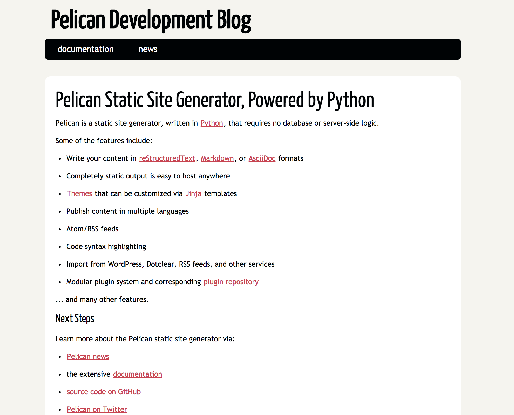

Title: Create Your Own Website by Pelican and GitHub
Date: 2017-10-09 10:20
Modified: 2017-10-09 19:30
Category: Tech
Tags: pelican, github
Slug: create-your-own-website-by-pelican-and-github


If you would like to create your own static website, Pelican (Pelican is a static site generator, written in Python) + Github(Host) might be a simple and great option. I have a mix of love and hate to online tutorial, which are usually uncomplete so you have to do put them together and figure out a solution. In this post I would like to list all the steps that I put together as my records and hopefully, it will be useful to someone.

###Prerequisites
* Python 2.7 
* GitHub Account

###Install Pelican 
Assume you have installed pip install then the first step should be install [pelican](http://docs.getpelican.com/en/stable/install.html)

`pin install pelican`

You could also install [markdown](https://pypi.python.org/pypi/Markdown) if you using markdown as a markup format

`pip install Markdown`

Another import package is [fabric](http://www.fabfile.org/), which will help you generate your html file.

`pip install fabric`

### Set up GitHub 
GitHub provide web host service for its users and detailed project to be find at [GitHub](https://pages.github.com/). All you need to do is to create a
repository 
 
 `yourusrname.github.io`
 
 under your github account and put the html file that generated by Pelican in this folder. 
 
Here are the few steps that you need to do toset up your website.

1. Create `yourname.github.io` folder in your GitHub account
2. Create a folder that contain the source code for your pelican project 

```
echo "# source" >> README.md
git init
git add README.md
git commit -m "first commit"
git remote add origin https://github.com/WenxuanZhang/source.git
git push -u origin master
```
### Create your fist Pelican Project
Then you could start to create your first pelican project in the source folder that you created at your local 

```
cd source 
pelican-quickstart
```
Then answering the following questions

```
Welcome to pelican-quickstart v3.7.1.

This script will help you create a new Pelican-based website.

Please answer the following questions so this script can generate the files
needed by Pelican.

    
> Where do you want to create your new web site? [.] 
> What will be the title of this web site? Hello, World
> Who will be the author of this web site? Wenxuan
> What will be the default language of this web site? [en] 
> Do you want to specify a URL prefix? e.g., http://example.com   (Y/n) n
> Do you want to enable article pagination? (Y/n) y
> How many articles per page do you want? [10] 10
> What is your time zone? [Europe/Paris] 
> Do you want to generate a Fabfile/Makefile to automate generation and publishing? (Y/n) y
> Do you want an auto-reload & simpleHTTP script to assist with theme and site development? (Y/n) y
> Do you want to upload your website using FTP? (y/N) n
> Do you want to upload your website using SSH? (y/N) n
> Do you want to upload your website using Dropbox? (y/N) n
> Do you want to upload your website using S3? (y/N) n
> Do you want to upload your website using Rackspace Cloud Files? (y/N) n
> Do you want to upload your website using GitHub Pages? (y/N) y
> Is this your personal page (username.github.io)? (y/N) y
Done. Your new project is available at /Users/wenxuanzhang/LocalDoc/GitHub/source
```
Now you have your first Pelican project in the following structure

```
yourproject/
├── content
│   └── (pages)
├── output               # The collection folder and html file that avaiable to publish
├── develop_server.sh
├── fabfile.py
├── Makefile
├── pelicanconf.py       # Main settings file
└── publishconf.py       # Settings to use when ready to publish
```
Then conpile your file and get your first website

```
make devserver

```

Then you could see your webapge at 

[http://localhost:8000/](http://localhost:8000/)
something like 



### Push the Project to Git Hub
The the problem comes how to automatically push the file and folder that generated in the output folder into `yourname.github.io` folder?

All you need to do is 

```
cd output
git init
git remote add origin https://github.com/username/username.github.io.git
git add --all
git commit -m "commit message"
git push origin master

```
These command push the folder and file in the output folder to github and hen you could see your website at 

https://github.com/username/

### Select a theme for your project 
Pelican provide various [theme](http://www.pelicanthemes.com/) that you could use for your website. 

This site is created based on [VoidyBootstrap](http://www.voidynullness.net/page/voidy-bootstrap-pelican-theme/). 

The process of inlcuding a theme is simple. First go to the [github page of voidynullness](https://github.com/robulouski/voidy-bootstrap)

First create `sourcefolder/pelican-themes` folder then install pelican-themes & pelican - plugins 

```
git clone https://github.com/getpelican/pelican-plugins.git

git clone --recursive https://github.com/getpelican/pelican-themes ./pelican-themes

```

After that, you could specify  your pelican configuration file.

```
THEME = "pelican-themes/voidy-bootstrap"
PLUGIN_PATHS = ['pelican-plugins']
PLUGINS = ['assets']
# Adding Side Bar
SIDEBAR = "sidebar.html"
CUSTOM_SIDEBAR_MIDDLES = ("sb_links.html", "sb_taglist.html", )
JINJA_ENVIRONMENT = {'extensions': ['jinja2.ext.i18n']}
# Extra stylesheets, for bootstrap overrides or additional styling.
STYLESHEET_FILES = ("pygment.css", "voidybootstrap.css",)

# Put taglist at end of articles, and use the default sharing button implementation.
CUSTOM_ARTICLE_FOOTERS = ("taglist.html", "sharing.html", )
CUSTOM_SCRIPTS_ARTICLE = "sharing_scripts.html"

```

If you are working on python 2.7, then you could use a simple command 

```
fab build
```
in your blogsource folder. The push the result in the output folder to the GitHub.


### Writing Articles and Publish
After set up your web site, you could start to work on your first article. 

The simplest way to write arctile is using Markdown. There are multiple sources for that and if you were a apple users, you could download [MacDown](https://macdown.uranusjr.com/) .

By simply create .md file in the content folder, you could publish articles on your website. But please remember to add the following line at the top of your article

```
Title: Create Your Own Website by Pelican and GitHub 
Date: 2017-10-09 10:20
Modified: 2017-10-09 19:30
Category: Tech
Tags: pelican, github
Slug: create-your-own-website-by-pelican-and-github

```

* Title: the title of your article
* Date: the date the file was created, pelican post the article by time order
* category: something you defined
* tags: what is this article about
* Slug: the url of the article, based on the above slug, the urls of this article is https://wenxuanzhang.github.io/create-your-own-website-by-pelican-and-github.html


Besides, after generating the html file using fab build command, you need to push the content in your output folder to github, to avoiding repetitive work, I have create a shell script named autopush.sh

```
    #!/bin/sh
    git add .
    git commit -m "$1"
    git push origin master
```
All you need to do is change the mod of the file to 

```
chmod 700 auotopush.sh

```
and make it an exeuctable.

After that you can push your change by 

```
./autopush "commit message"

```

That's it. Start to build your first website now and you can make it. 


### Reference
1. [Migrating to GitHub Pages using Pelican](http://mathamy.com/migrating-to-github-pages-using-pelican.html) by Amy Hannon

2. [How to Create Your First Static Site with Pelican and Jinja2
Posted by Matt Makai on June 09, 2017.](https://www.fullstackpython.com/blog/generating-static-websites-pelican-jinja2-markdown.html) by Matt Makai

3. [Configuring Pelican Static Blog](http://pbpython.com/pelican-config.html) by [Chirs Moffitt](http://pbpython.com/pelican-config.html)


