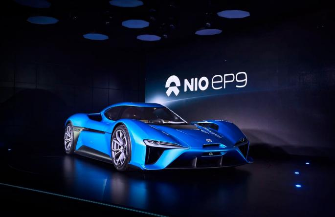

Title:A New Era ahead of us - Electric Vehicle Industry Research
Date: 2017-10-28 10:24
Modified: 2017-10-28 19:34
Category: Business
Tags:electric vehicle
Slug: a_new_era_ahead_of_us_electric_vehicle_industry_research
Authors: Wenxuan Zhang
Summary: Short version for index and feeds

##Content 
* [How Electric Vehicle Gonna to Change the World ?](#how-electric-vehicle-gonna-to-change-the-wolrd)
* [Electric Vehicle Industry Overview](#electric-vehicle-industry-overview)
 * [History](#history)
 * [The External Environment](#the-external-enviorment)
     * [Economy](#economy) 
     * [Politics](#politics)
     * [Social](#social)
     * [Tech](#tech)
 * [Market Size and Trend](#market-size-and-trend)
 * [Industrial Chain](#industrial-chain)
 * [Key Players and Their Strategies](#key-players-and-their-strategies)
* [Industry Characteristics](#industry-characteristics)
   * [Barriers to Enter](#barriers-to-enter)
   * [Potential Risk](#potential-risk)
   * [Key Successful Factor](#key-successful-factor)
* [Customer Analysis](#customer-analysis)
  * [Customer Attribute]()
  * [Customer Preference]()
  * [Customer Segementation]()
* [Potential Investment Opportunities]()
  * [Individual]()
  * [Business]()
   
### How Electric Vehicle Gonna to Change the World ?
### Electric Vehicle Industry Overview
#### Histroy
#### The External Environment 
##### Economy
##### Politics
##### Social
##### Tech
#### Market Size and Trend
#### Industrial Chain
#### Key Players and Their Strategies
#### Industry Characteristics
##### Barriers to Enter
##### Potential Risk
##### Key Successful Factor

