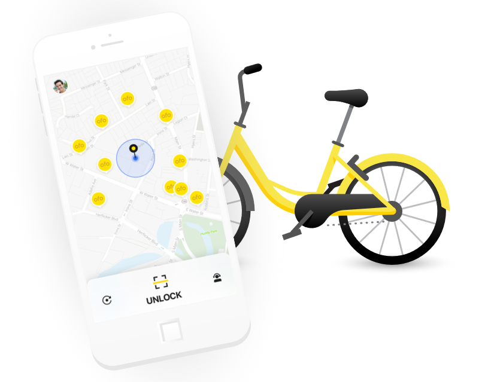

Title: 5 Element of a Great Business Model - Why OfO is a great business?
Date: 2017-10-28 10:24
Modified: 2017-10-28 19:34
Category: Business
Tags:electric vehicle
Slug: 5-element-of-a-great-business-model
Authors: Wenxuan Zhang
Summary: Short version for index and feeds

A good business model should solve the following problems:

* What demand was satisfied?
* Market Size
* Friction with current players
* Moat
* How to make money

Bike Sharing swept across the China, then the world in the past three years. The two key players MoBike and OfO is valued 2-3 billion and 3 billion respectively. Why the investers having so much confidence in the biks sharing business that pricing at $1 per hour? The secret behind it is that bike sharing business is a perfect example of a great business model.

First, it perfectly solved that "last mile" problem. Just thinking how hard it is to find a parking place in a big city. If there is a sharing bike at the parking lot, then you could park, get a bike and got wherever you want and just drop the bike at the road that allowed parking. What a relief!

Second, The market size is huge.Especially in the big city with high population density like Shanghai, Beijing and Shenzhen. According to iiMedia, there will be 3,760,000 share bike user in China in 2019. 

Third, there is very few conflicts between the bike sharing business with other companies taxi, car-sharing services. Their relationship are more like complementary than substitution. 

Fourth, competition might be fierce in the beginning stage while later the market will be dominated by a few companies and it will be hard for other competitor to break in. 

Fifth, how to make money. The secret about making money is not to $1/hour fee, but the deposit. OfO deposit fee is $39 in U.S. OfO has invested 1,780,000 into market and consider there are about 5 person deposit on the one bike then the total deposit amount will reach $3.47 billion. The the bike sharing comapny could leverage these deposit to invest and gain other returns. 

 

